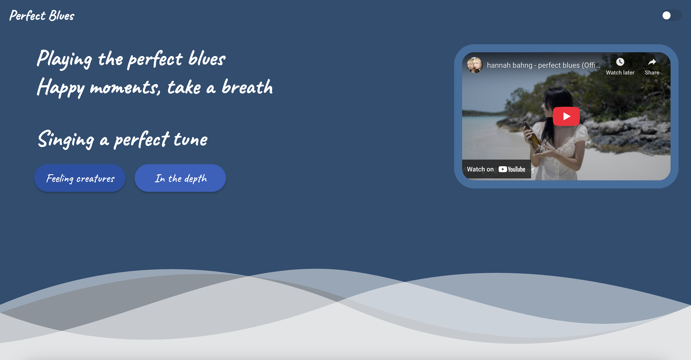

# Responsive Design

For this project, I made a simple landing page using HTML CSS, and JS that toggles between a light and dark mode, and has a responsive layout. It's inspired by Hannah Bahng's Perfect Blues for the light theme and Abysmal for the dark theme.

   
  
  
   

  <a href="#Files">Files</a> •
  <a href="#how-to-use">How To Use</a> • 

<a href="https://perfectblues.netlify.app/">Try it out here</a> 

## Files
- assets: resources that are used in the project.
- index.html: the main file of the project.

## How To Use

To clone and run this project locally, you'll need [Git](https://git-scm.com) and [Live Server extension for Visual Studio Code](https://marketplace.visualstudio.com/items?itemName=ritwickdey.LiveServer) installed on your computer. 

Open the project and click on "Go Live" on the status bar to launch the server.
